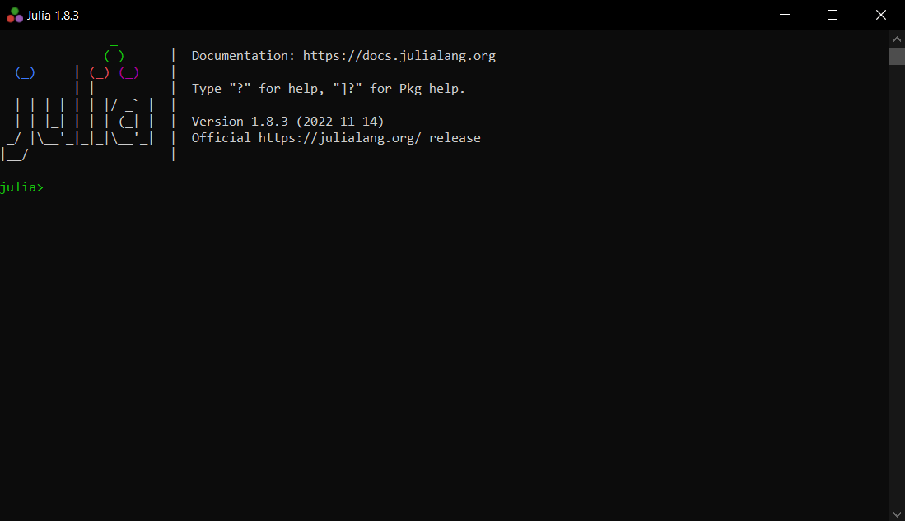

# FDMremote_GH
FDMremote provides a series of Grasshopper components for Tension/Compression structure form-finding using the Force Density Method. It provides a set of native components for the analysis of small to medium networks, but also provides a a communication link to its sister package, [FDMremote.jl](https://github.com/keithjlee/FDMremote), for extremely fast one-time analysis and multi-step optimization. Client-server communication is made possible by integrating the work of [Behrooz Tahanzadeh](https://github.com/behrooz-tahanzadeh) and his [Bengesht](https://github.com/behrooz-tahanzadeh/Bengesht) plugin for Grasshopper.

Using the native `Analyze` component should be for networks with less than ~300 elements. For much larger networks, use the `FDMstart,FDMsend,FDMlisten` suite of components to communicate with a local Julia server. The above image is a network with ~5000 elements, optimized via Julia to reach an equilibrium solution that reads `FDMremote`.

# Components
## Design
### Create Network `Create`

Generates a `FDMremote.Network` object.

Inputs:
- `E`: list of curves that define network edges
- `A`: list of points that define anchors (fixed nodes)
- `q`: force densities (default = 1.0). Option for:
  - single value to apply to all elements
  - list of values where `|q|==|E|` for individual values
- `tol`: distance tolerance to detect connectivity (default 0.01)

Output:
- `Network`

### Analyze Network `Analyze`

Solves for equilibrium nodal positions.

Inputs:
- `Network`: network to be analyzed
- `P`: list of vectors that define applied loads (default = 0). Option for:
  - single vector to apply to all **free** nodes.
  - list of vectors where `|P| == |Nfree|` to apply unique load values.
  - to do: apply directly to a point

Output:
-`Network`: new network with equilibrium node positions

**NOTE:** the current implementation has drastic performance issues for networks with more than ~300 edges. Defining large networks will output a warning, and is not recommended. This is where the *remote* part of `FDMremote` comes in. See the **Optimization** section below.

## Utility
These components are used for querying, visualizing, and saving/loading networks.

### Network Information `Info`

Extract all geometric/numeric information from a network.

Inputs:
- `Network`: network to query

Outputs:
- `N`: list of all nodes
- `E`: list of all edges
- `A`: list of all anchor points
- `q`: list of force densities
- `Ne`: number of edges in network
- `Nn`: number of nodes in network
- `iN`: indices of free nodes in `N`
- `iF`: indices of fixed nodes in `N`
- `Force`: edge forces = `length(element) * q(element)`
  - **NOTE:** this is a naive calculation that assumes all element lengths are at a stressed state, and thus will provide nonsense values for unsolved networks
- `Reactions`: force vectors at anchor points applied to network. See `Force` for warning.

### Visualize Network `Visualize`
 

Visualizes a network.

Inputs:
- `Network`: network to visualize
- `P`: collect of vectors representing applied loads. See `Analyze` for input requirements
- `PScale`: all loads are by default normalized to 1 unit in length. This value scales the length of force arrows.
- `Cmin`: colour for minimum value in display gradient (see below). Defaults to white.
- `Cmax`: colour for maximum value in display gradient (see below). Defaults to blue.
- `Property`: elemental property to colour. Right click to access options:
  - `None`: no property; all elements are coloured by `Cmax`
  - `Force` (default): coloured by edge force values
  - `Q`: coloured by force density
- `Thickness`: line weight
- `Cload`: colour of external loads. Defaults to pink.
- `Load`: boolean toggle to display external loads.
- `Creaction`: colour of reaction forces. Defaults to green.
- `Reaction`: boolean toggle to display reaction forces.

### Element Tagger `Tagger`

Displays element-wise numeric information for each element: length, force, and force density.

Inputs:
- `Network`: network to analyze
- `Show`: boolean toggle to show tags
- `Size`: size of text
- `Colour`: colour of text

### Curve to Curve `CurvePairs`

Displays the paired elements in an unstressed vs. stressed network. Useful for large deformations post-analysis.

Inputs:
- `Network1`: network containing starting position of elements
- `Network2`: network final position of elements
- `Colour`: colour of lines
- `Weight`: line weight
- `Show`: toggle visualization

### Baker `Baker`

Provides a simplified set of output geometry for baking into Rhino.

Inputs:
- `Network`: network to bake

Outputs:
- `Curves`: collection of curves that define network edges
- `Anchors`: collection of points that define network anchors

### Save Network `Save`

Save all relevant network information into a parsable `.json` format.

Inputs:
- `Network`: network to save
- `P`: optional load vectors associated with network (defaults to 0 vector). See `Analyze` for limitations.
- `Dir`: folder to save to. Must be in the format eg: `C:\\Users\\keith\\Desktop\\`; double backslashes required.
- `Name`: name of file. Must end in `.json`
- `Freeze`: toggle to save network; attach this to a `button` component in Grasshopper.

Outputs:
- `E`: edges that were save
- `A`: anchors that were saved
- `q`: force densities that were saved

### Load Network `Load`

Load a network `.json` file.

Inputs:
- `Dir`: folder to load from. Must be in the format eg: `C:\\Users\\keith\\Desktop\\`; double backslashes required.
- `Name`: name of file. Must end in `.json`

Outputs:
- `Curves`: network edges
- `Anchors`: network anchors
- `q`: network force densities
- `P`: applied loads

These can be directly fed into the `Create` and `Analyze` components to recreate the saved network.

# Optimization
These components form the core of `FDMremote`, by providing a link between the Grasshopper/Rhino front end and a high-performing FDM solver/optimizer running in a local Julia server. Communication between the Grasshopper client and the Julia server is through the Websocket protocol. The grasshopper client side is made possible by the [Bengesht](https://github.com/behrooz-tahanzadeh/Bengesht) plugin developed by [Behrooz Tahanzadeh](https://github.com/behrooz-tahanzadeh), modified and integrated into `FDMremote`.

`FDMremote_GH` works best with its sister package [FDMremote.jl](https://github.com/keithjlee/FDMremote).

## Installation
### Download Julia
You can download Julia [here](https://julialang.org/). Note that this package only works for Windows machines.

### Install `FDMremote`
Once Julia is installed, open it from the start menu.

Press the `]` key to enter package mode:

Add the `FDMremote.jl` package by writing: `add https://github.com/keithjlee/FDMremote` and pressing enter.

Once installed, return to the regular julia interpreter by pressing back on your keyboard. When you are ready to use the FDMremote link while working in Grasshopper, reopen your Julia REPL and load the package: `using FDMremote`. This may take a while if it's your first time using it.

To start the server, write `FDMsolve!()` in the REPL and press enter. Note that the default host:port address of `127.0.0.1:2000` can be customized via `FDMsolve!(host = "xxx.x.x.x", port = "xxxx")`.

In theory, you can now ignore the REPL for as long as you are working in Grasshopper. However, it's useful to keep an eye on it to keep track of optimization runs and the status of the connection.

## Optimization Components

### Remote Start `FDMstart`

This component manages the connection between Grasshopper and Julia.

Inputs:
- `Rst`: reset switch to reconnect to server. Attach a `Button` component here.
- `Host`: host address. Defaults to `127.0.0.1`
- `Port`: port. Defaults to `2000`

Output:
- `WSC`: Websocket object; the object that is communication with the server.

### Remote Send `FDMsend`

This component collects relevant information about your problem and sends to the Julia server for solving. 

Inputs:
- `WSC`: the active Websocket object; the output of `FDMstart` goes here.
- `Network`: the network under analysis
- `Params`: parameters for optimization (more below); this is **optional**. If no parameters are provided, the Julia server simply analyzes the network like the `Analyze` component, just much faster.,
- `P`: loads applied to network for analysis
- `Close`: close the client server. Attach a boolean toggle here and leave as `False` until you are finished.
  - **NOTE:** it's highly recommended to close the julia server with this toggle when you're finished using it, and then restarting the server on the julia REPL through `FDMsolve!()` when neede.d

### Remote Listen `FDMlisten`

Receives the solved information from the julia server.

Inputs:
- `WSC`: connect to the output of `FDMstart`
- `Upd`: whether or not to automatically update output to new messages. Defaults to true
- `Network`: network under analysis

Outputs:
- `Data`: the raw return message from the server
- `Sts`: the status of the Websocket connection
- `Finished`: whether an optimization run is finished (ignore if not optimizing)
- `q`: the list of force densities that are changed by the optimizer
- `f(q)`: the current objective function value
- `iter`: the current iteration during optimization
- `f(q(t))`: the entire history of the optimization run
- `Network`: the solved network

### Optimization Parameters `Params`

Define the parameters for optimization if desired.

Inputs:
- `Obj`: collection of objective functions (see **Objective Functions** below). Defaults to the `Null Objective`, which is the same as not having a `Params` component at all.
- `LB`: lower bound of `q` values during optimization. Default = 0.1
- `UB`: upper bound of `q` values during optimization. Default = 100.0
- `AbsTol`: the absolute tolerance of the design variables to halt optimization. Default = 1e-3
- `RelTol`: the relative tolerance of the objective function to halt optimization. Not currently in use.
- `MaxIter`: maximum number of iterations during optimization. Default = 400.
- `Frequency`: frequency return messages from the server during optimization. Default = 20.
  - A warning will show up for frequencies <10 to prevent overloading.
- `ShowIter`: whether or not to send intermittent messages back from the server. Default = true (nice to look at what's going on)

## Objective functions
These components form a collection of composable objective functions for optimization. All objective functions have a default weight of 1 that can be adjusted by the user to tune relative importance. The weights are converted into relative values during optimization. Note that due to the wide range of objective types, the function values of each objective have significant variance in magnitude - this is a limitation that requires careful testing and calibration by the user.

### Target `OBJTarget`

Minimize distance to a target shape. This is used for inverse form-finding of networks. It amounts to minimizing the distance each node travels from its starting position to reach the equilibrium state. Manipulate the base geometry in Rhino as you see fit, and let this objective function find an tension/compression only geometry that best meets this shape.

### Performance `OBJPerformance`

Minimize ∑FL across all edges of the network. Proxy measure of structural 'performance'.

### Force Variation `OBJForce`

Minimize the difference between the largest and smallest internal forces in the network.

### Length Variation `OBJLength`

Minimize the difference between the longest and shortest elements in the network.

### Minimum Force `OBJMinForce`

Minimize the number of elements that experience less than a threshold force.

Additional input:
- `Force`: the threshold force. Default = 1

### Maximum Force `OBJMaxForce`

Minimize the number of elements that experience more than a threshold force.

Additional input:
-`Force`: the threshold force. Default = 10000

### Minimum Length `OBJMinLength`

Minimize the number of elements shorter than a threshold length.

Additional input:
- `Length`: the threshold length. Default = 1

### Maximum Length `OBJMaxLength`

Minimize the number of elements longer than a threshold length.

Additional input:
- `Length`: the threshold length. Default = 1000

